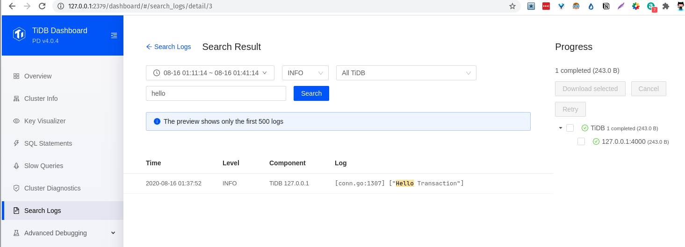

# week 1 of High Performance TiDB 课程学习计划

## Step 1: build modified tidb by calling `make`. Then tiup with the tidb binary file with pd, tikv from remote docker image:

```
$ tiup playground --db.binpath ./bin/tidb-server --db 1 --pd 1 --kv 3
Starting component `playground`:  --db.binpath ./bin/tidb-server --db 1 --pd 1 --kv 3
Use the latest stable version: v4.0.4

    Specify version manually:   tiup playground <version>
    The stable version:         tiup playground v4.0.0
    The nightly version:        tiup playground nightly

Playground Bootstrapping...
Start pd instance...
Start tikv instance...
Start tikv instance...
Start tikv instance...
Start tidb instance...
.......
Waiting for tikv 127.0.0.1:20160 ready
Waiting for tikv 127.0.0.1:20161 ready
Waiting for tikv 127.0.0.1:20162 ready
Start tiflash instance...
Waiting for tiflash 127.0.0.1:3930 ready ...
CLUSTER START SUCCESSFULLY, Enjoy it ^-^
To connect TiDB: mysql --host 127.0.0.1 --port 4000 -u root
To view the dashboard: http://127.0.0.1:2379/dashboard
To view the Prometheus: http://127.0.0.1:9090
To view the Grafana: http://127.0.0.1:3000
```

## Step2: connect to DB,
```
fxrc @ pop in ~/Projects/PingCapTalent/tidb on git:hp-week-1 o [1:38:08]
$ mysql -h127.0.0.1 -P4000 -uroot test

Welcome to the MySQL monitor.  Commands end with ; or \g.
Your MySQL connection id is 12
Server version: 5.7.25-TiDB-v4.0.0-beta.2-961-g383366270 TiDB Server (Apache License 2.0) Community Edition, MySQL 5.7 compatible

Copyright (c) 2000, 2020, Oracle and/or its affiliates. All rights reserved.

Oracle is a registered trademark of Oracle Corporation and/or its
affiliates. Other names may be trademarks of their respective
owners.

Type 'help;' or '\h' for help. Type '\c' to clear the current input statement.

mysql> show tables;
Empty set (0.00 sec)

mysql> show databases;
+--------------------+
| Database           |
+--------------------+
| INFORMATION_SCHEMA |
| METRICS_SCHEMA     |
| PERFORMANCE_SCHEMA |
| mysql              |
| test               |
+--------------------+
5 rows in set (0.00 sec)

mysql> CREATE TABLE runoob_transaction_test( id int(5)) engine=innodb;
Query OK, 0 rows affected (0.13 sec)

mysql> show tables;
+-------------------------+
| Tables_in_test          |
+-------------------------+
| runoob_transaction_test |
+-------------------------+
1 row in set (0.00 sec)

mysql> select * from runoob_transaction_test;
Empty set (0.00 sec)

mysql> begin;
Query OK, 0 rows affected (0.00 sec)

mysql>
```

## Step3: open the dashboard -> search logs -> instance (All TiDB)



